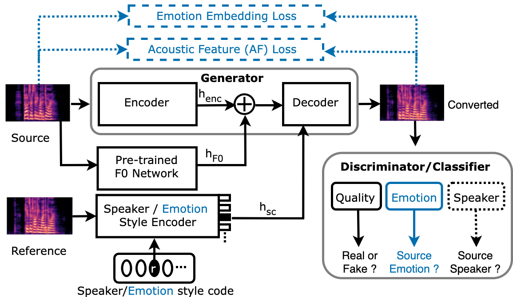

# Emo-StarGAN 

This repository contains the source code of the paper *[Emo-StarGAN: A Semi-Supervised Any-to-Many Non-Parallel Emotion-Preserving Voice Conversion](https://www.researchgate.net/publication/373161292_Emo-StarGAN_A_Semi-Supervised_Any-to-Many_Non-Parallel_Emotion-Preserving_Voice_Conversion), accepted in Interspeech 2023*. An overview of the method and the results can be found [here](https://github.com/suhitaghosh10/emo-stargan/blob/main/overview.pdf).




## Highlights:
- Emo-StarGAN: An emotion-preserving deep semi-supervised voice conversion-based speaker anonymisation method is proposed.
- Emotion supervision techiniques are proposed: (a) Direct: using emotion classifier (b) Indirect: using losses leveraging acoustic features and deep features which represent the emotional content of the source and converted samples.
- The indirect techniques can also be used in the absence of emotion labels.
- Experiments demonstrate its generalizability on the following benchmark datasets, across different accents, genders, emotions and cross-corpus conversions:
  - [Emotional Speech Dataset (ESD)](https://hltsingapore.github.io/ESD/)
  - [Ryerson Audio-Visual Database of Emotional Speech and Song (RAVDESS)](https://www.kaggle.com/datasets/uwrfkaggler/ravdess-emotional-speech-audio)
  - [Centre for Speech Technology Voice Cloning Toolkit (VCTK)](https://datashare.ed.ac.uk/handle/10283/2950)

## Samples
Samples can be found [here]()

## Pre-requisites:
1. Python >= 3.7
2. Install the python dependencies mentioned in the requirements.txt

## Training:

### Before Training
1. Before starting the training, please specify the number of target speaskers in `num_speaker_domains` and other details such as training and validation data in `config.yml` file.
2. Download VCTK and ESD datasets. For VCTK dataset preprocessing is needed, which can be carried out using Preprocess/getdata.py. The dataset paths need to be adjusted in train and validation lists present in Data/.
3. Download and copy the emotion embeddings [weights](https://drive.google.com/drive/folders/1FEVATENYW6vCiTFeJNoa64piOiV_Joyh?usp=sharing) to the folder Utils/emotion_encoder
4. Download and copy the vocoder [weights](https://drive.google.com/drive/folders/1xcMLR-jkRC5FmTcyp1e8neKT9mbwV9bb?usp=sharing) to the folder Utils/Vocoder

### Train
```bash
python train.py --config_path ./Configs/speaker_domain_config.yml
```

### Model Weights
The Emo-StarGAN model weights can be downloaded from [here](https://drive.google.com/drive/folders/1FKETSKT71L4GjSTexbJG6LcMWr0b1u7r?usp=sharing). 


## Common Errors
When the speaker index in `train_list.txt` or `val_list.txt` is greater than the number of speakers ( the hyperparameter `num_speaker_domains` mentioned in `speaker_domain_config.yml`).
The speaker index starts with 0 (not with 1!) in the training and validation lists.

**Error message:** `[train]:   0%| | 0/66 [00:00<?, ?it/s]../aten/src/ATen/native/cuda/IndexKernel.cu:92: operator(): block: [0,0,0], thread: [0,0,0] Assertion index >= -sizes[i] && index < sizes[i] && "index out of bounds" failed.`


## References
- [yl4579/StarGANv2-VC](https://github.com/yl4579/StarGANv2-VC/)
- [kan-bayashi/ParallelWaveGAN](https://github.com/kan-bayashi/ParallelWaveGAN)
- [keums/melodyExtraction_JDC](https://github.com/keums/melodyExtraction_JDC)
